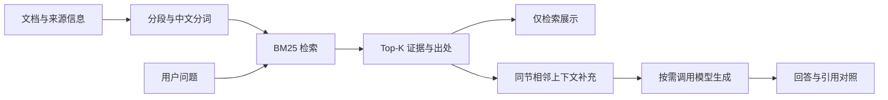
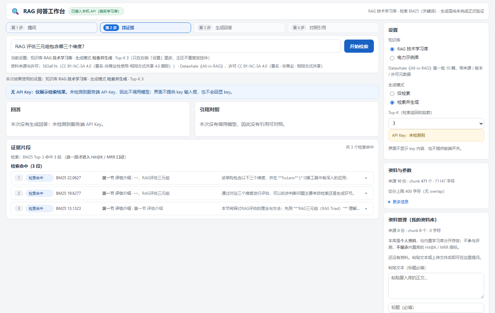

# 带出处的技术文档问答（RAG）

一个用于个人学习与求职展示的 RAG 项目：把技术文档切成保留来源与章节的片段，先检索证据，再按需调用模型组织回答。重点是**检索结果可检查、实验结果可复核、失败原因能解释**。

仓库名沿用早期的 `rag-power-regs`。目前主要实验资料是 Datawhale 的 All-in-RAG 技术教程；电力资料只是早期自编演示语料。

**推荐阅读：** [项目复盘与个人职责](docs/PROJECT.md) · [评测结果与失败分析](docs/EVALUATION.md) · [本地运行](docs/QUICKSTART.md) · [代码导航](docs/README.md)

## 为什么做这个项目

读技术资料时，我希望回答能指回原文，也希望知道“检索没找到证据”和“模型没用好证据”分别发生在哪里。因此先建立 BM25 基线和评测集，再增加工作台与本地向量对照实验，而不是只做一个聊天界面。

## 一眼看懂项目

| 部分 | 已完成的工作 |
|---|---|
| 资料整理 | 固定 All-in-RAG 的一个版本，转换 10 篇文档，按标题与段落切成 471 个片段，保留来源与章节 |
| 检索基线 | BM25 + jieba 分词；展示原文片段、章节、来源链接和检索得分 |
| 评测 | 自建 30 道题，其中 27 道有标准证据、3 道用于观察资料外问题；逐题保存命中结果 |
| 对照实验 | 用本地 BGE 小模型 + FAISS 与 BM25 比较；固定语料、题目、检索深度与判据 |
| 本地使用 | React 工作台、本机 Python API、用户资料库、批量问题与 CSV / DOCX 导出；提供 Windows 打包脚本 |

同节补充用于给模型提供更完整的上下文，与原始检索命中分开展示，**不计入 Hit@K / MRR**。本地向量检索目前用于离线对照实验，工作台检索主线仍是 BM25。

## 实际界面

历史本机验收截图：使用真实学习资料检索，未配置模型 Key，只展示检索证据。截图用于说明界面与出处展示方式，不证明回答质量。

## 检索结果：向量方法并非全面优于 BM25

同一套 471 个片段、27 道计分题、Top-5 检索结果，按标准证据是否进入前 K 条计算：

| 方法 | Hit@1 | Hit@3 | Hit@5 | MRR@5 |
|---|---:|---:|---:|---:|
| BM25 + jieba | 19/27（70.37%） | 24/27（88.89%） | 26/27（96.30%） | 0.8111 |
| 本地 BGE + FAISS | 22/27（81.48%） | 23/27（85.19%） | 25/27（92.59%） | 0.8457 |

向量方法更常把证据排到第一条，但前 3 / 5 条的覆盖反而下降。因此我保留 BM25 作为主线，先分析逐题差异，再决定是否值得加入融合检索。

**这些是检索指标，不是回答准确率。** 27 道题是本项目自建的小型评测集，结果只说明本轮语料与题目上的表现。报告、逐题 CSV 和已知失败见 [评测说明](docs/EVALUATION.md)。

## 我的职责与实现方式

我负责问题定义、项目范围、资料与评测设计、取舍判断、验收和复盘；代码开发与部分检查由 CodeBuddy / Codex 辅助完成。面试时重点解释为什么这样设计、指标如何计算、哪里失败以及下一步怎么验证，不把 AI 辅助编写的代码说成全部独立手写。

项目使用已有的 BM25 方法、开源嵌入模型和第三方框架，没有训练新的模型。技术选择与个人工作细节见 [项目复盘](docs/PROJECT.md)，资料来源见 [NOTICE](NOTICE.md)。

## 如何查看和体验

1. 先看 [项目复盘](docs/PROJECT.md)，了解问题、取舍和个人职责。
2. 查看 [逐题对照 CSV](output/vector_vs_bm25_detail.csv) 和 [评测说明](docs/EVALUATION.md)，核对数字及失败案例。
3. 按 [本地运行指南](docs/QUICKSTART.md) 体验。电力示例库无需模型 Key；完整技术学习库需要从固定版本的上游资料重新导入。

本仓库发布的是**源码与项目说明**。没有在这里提供可直接访问的在线问答服务；GitHub 页面也不会执行 Python 检索或模型请求。

## 现阶段的边界

- 生成层做过小批量真实调用与人工检查，仍需独立复核；不声称“零幻觉”或“回答准确率 96.3%”。引用能指回片段，也不等于片段一定支持回答中的每个结论。
- 用户资料库与基线学习库隔离；导入自己的资料后，不继承上面的评测数字。
- 混合检索、reranker、多轮记忆和模型微调尚未完成。
- 下一步优先复核已有回答的证据支持情况，再视逐题差异做小规模融合检索实验。

想看代码，从哪些文件开始？

- [rag_core.py](rag_core.py)：资料切分、BM25、同节上下文补充与生成入口。
- [04_eval.py](04_eval.py)：标准证据判据与检索评测。
- [06_eval_vector.py](06_eval_vector.py) / [vector_retriever.py](vector_retriever.py)：离线向量对照与发布产物校验。
- [api_v3.py](api_v3.py) / [frontend_v3](frontend_v3)：本地工作台。
- 其余文件的用途与推荐阅读顺序见 [代码导航](docs/README.md)。

